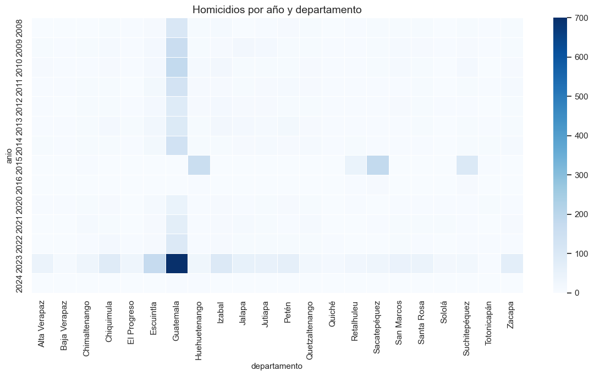
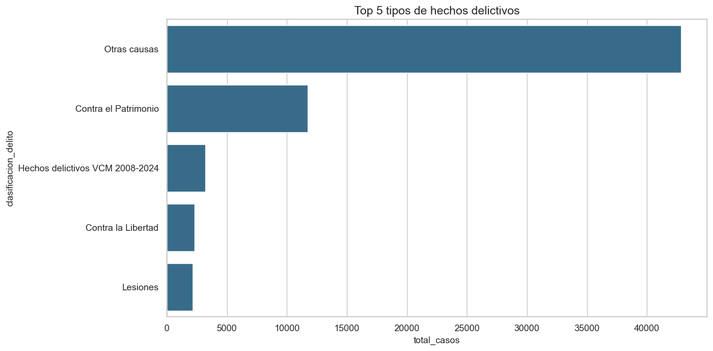
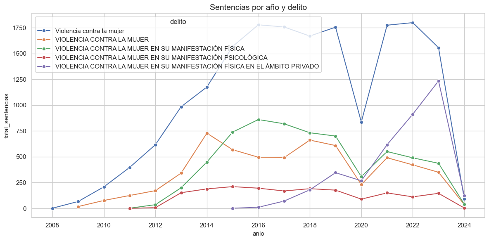
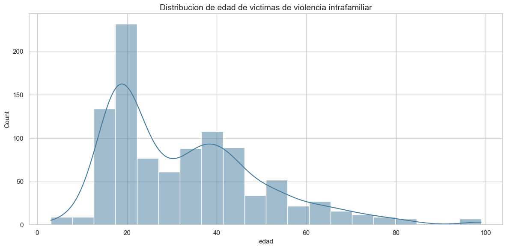
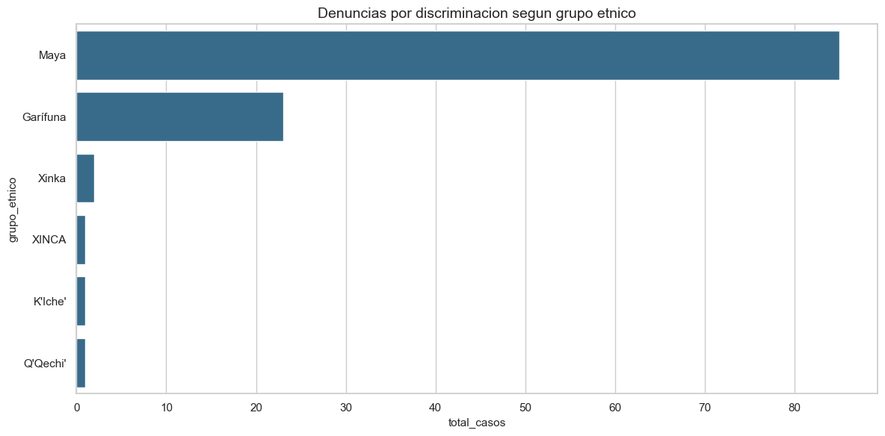
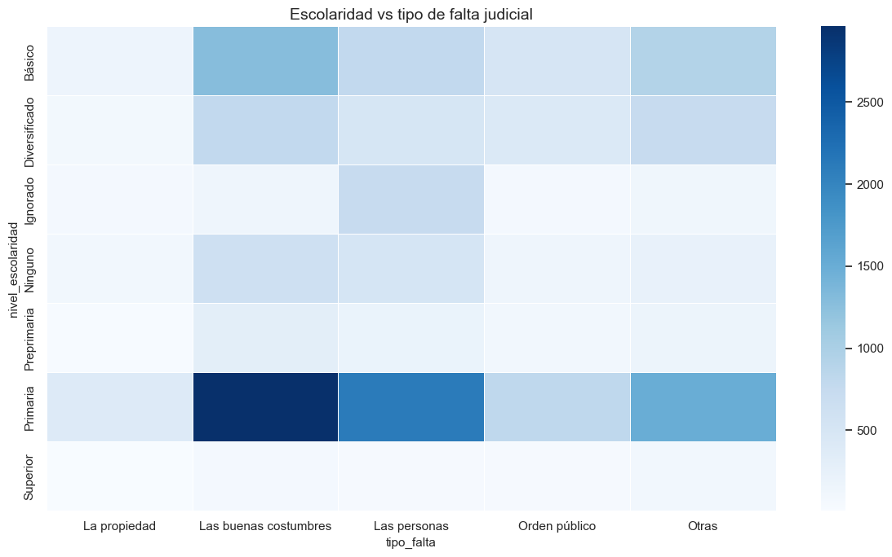
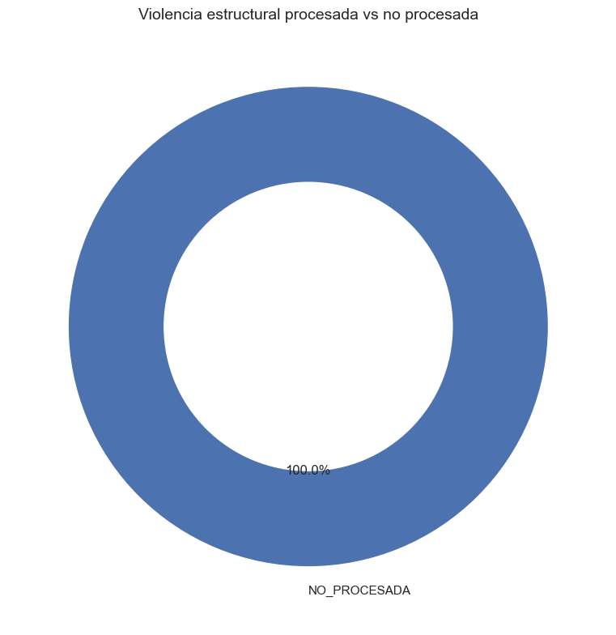
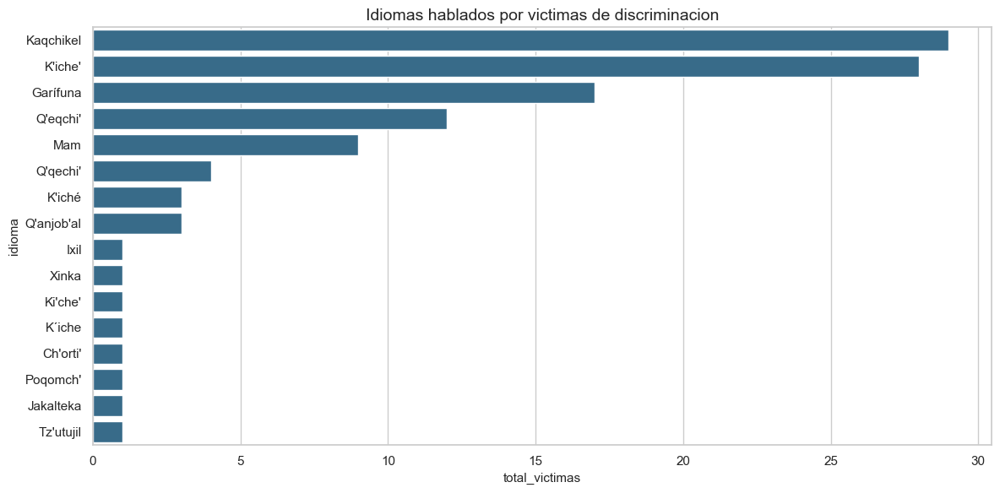
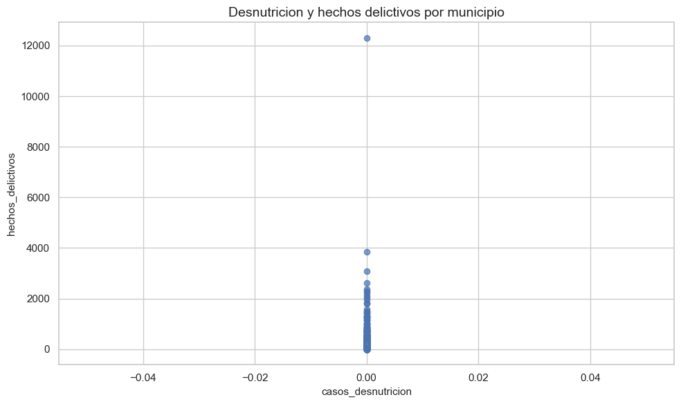

# Resumen de gráficas del cuaderno

Documento generado a partir de `entregables/graficas_consultas.ipynb`.

## Consulta 1: Homicidios por año y departamento

**Nombre de consulta**
Homicidios por año y departamento

**Gráfica**

**Descripción / interpretación**
Muestra la concentración territorial y temporal de homicidios. Permite identificar años y departamentos con mayor incidencia relativa.

---

## Consulta 2: Denuncias por violencia contra la mujer por departamento

**Nombre de consulta**
Denuncias por violencia contra la mujer por departamento

**Gráfica**
No se encontró salida gráfica en el cuaderno para esta consulta (la celda mostró texto o no tuvo datos).

**Descripción / interpretación**
Permite comparar rápidamente qué departamentos acumulan más denuncias asociadas a violencia contra la mujer.

---

## Consulta 3: Top 5 tipos de hechos delictivos en los ultimos 5 anios

**Nombre de consulta**
Top 5 tipos de hechos delictivos en los ultimos 5 anios

**Gráfica**

**Descripción / interpretación**
Resume las clasificaciones delictivas más frecuentes en el período reciente y ayuda a priorizar líneas de análisis.

---

## Consulta 4: Sentencias por anio y tipo de delito

**Nombre de consulta**
Sentencias por anio y tipo de delito

**Gráfica**

**Descripción / interpretación**
Describe la evolución de sentencias por año y por delito principal, útil para evaluar comportamiento judicial en el tiempo.

---

## Consulta 5: Distribucion de edad de victimas de violencia intrafamiliar

**Nombre de consulta**
Distribucion de edad de victimas de violencia intrafamiliar

**Gráfica**

**Descripción / interpretación**
Evidencia la distribución etaria de víctimas en violencia intrafamiliar e identifica los rangos con mayor frecuencia.

---

## Consulta 6: Embarazos adolescentes por departamento

**Nombre de consulta**
Embarazos adolescentes por departamento

**Gráfica**
No se encontró salida gráfica en el cuaderno para esta consulta (la celda mostró texto o no tuvo datos).

**Descripción / interpretación**
Comparación territorial de embarazos adolescentes para detectar departamentos con mayor carga de casos.

---

## Consulta 7: Casos de violencia infantil relacionados con trabajo infantil por sector economico

**Nombre de consulta**
Casos de violencia infantil relacionados con trabajo infantil por sector economico

**Gráfica**
No se encontró salida gráfica en el cuaderno para esta consulta (la celda mostró texto o no tuvo datos).

**Descripción / interpretación**
Relaciona violencia infantil con trabajo infantil por sector económico, útil para focalizar prevención interinstitucional.

---

## Consulta 8: Denuncias por discriminacion segun grupo etnico

**Nombre de consulta**
Denuncias por discriminacion segun grupo etnico

**Gráfica**

**Descripción / interpretación**
Refleja la distribución de casos de discriminación por grupo étnico y apoya el análisis de desigualdad estructural.

---

## Consulta 9: Escolaridad vs tipo de falta judicial

**Nombre de consulta**
Escolaridad vs tipo de falta judicial

**Gráfica**

**Descripción / interpretación**
Cruza nivel educativo y tipo de falta judicial para observar patrones de concurrencia entre variables sociales y judiciales.

---

## Consulta 10: Numero de necropsias por anio

**Nombre de consulta**
Numero de necropsias por anio

**Gráfica**
No se encontró salida gráfica en el cuaderno para esta consulta (la celda mostró texto o no tuvo datos).

**Descripción / interpretación**
Serie temporal de necropsias que permite observar incrementos o reducciones en eventos investigados forenses.

---

## Consulta 11: Violencia estructural procesada vs no procesada

**Nombre de consulta**
Violencia estructural procesada vs no procesada

**Gráfica**

**Descripción / interpretación**
Comparación entre casos procesados y no procesados de violencia estructural para medir avance institucional.

---

## Consulta 12: Idiomas hablados por victimas de discriminacion

**Nombre de consulta**
Idiomas hablados por victimas de discriminacion

**Gráfica**

**Descripción / interpretación**
Muestra los idiomas más reportados por víctimas de discriminación y aporta contexto sociocultural al análisis.

---

## Consulta 13: Personas por hogar en casos VIF

**Nombre de consulta**
Personas por hogar en casos VIF

**Gráfica**
No se encontró salida gráfica en el cuaderno para esta consulta (la celda mostró texto o no tuvo datos).

**Descripción / interpretación**
Describe el tamaño de hogar en casos VIF y ayuda a contextualizar el entorno familiar de los registros.

---

## Consulta 14: Desnutricion aguda por departamento y anio

**Nombre de consulta**
Desnutricion aguda por departamento y anio

**Gráfica**
No se encontró salida gráfica en el cuaderno para esta consulta (la celda mostró texto o no tuvo datos).

**Descripción / interpretación**
Permite comparar tendencia de desnutrición aguda por año en departamentos con mayor volumen de casos.

---

## Consulta 15: Desnutricion y hechos delictivos por municipio

**Nombre de consulta**
Desnutricion y hechos delictivos por municipio

**Gráfica**

**Descripción / interpretación**
Visualiza la relación entre desnutrición y hechos delictivos por municipio para explorar asociación territorial entre salud y violencia.

---
